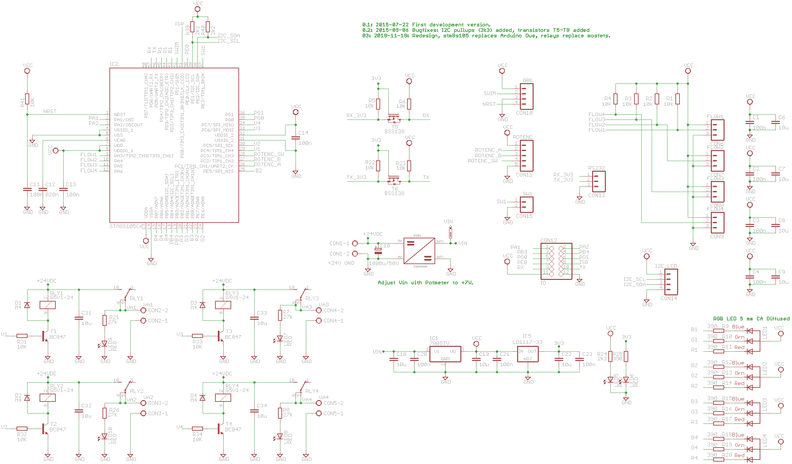
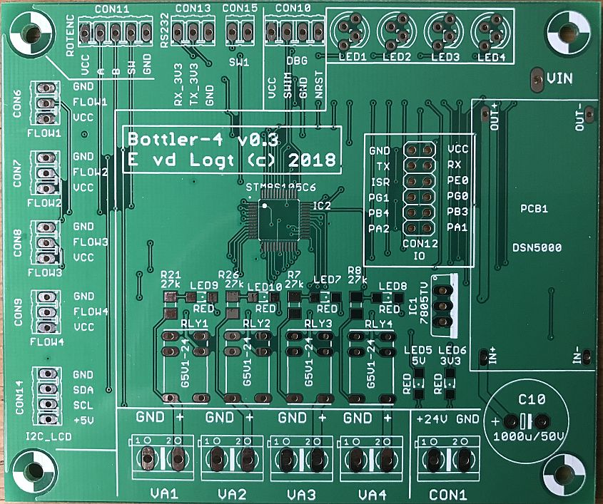
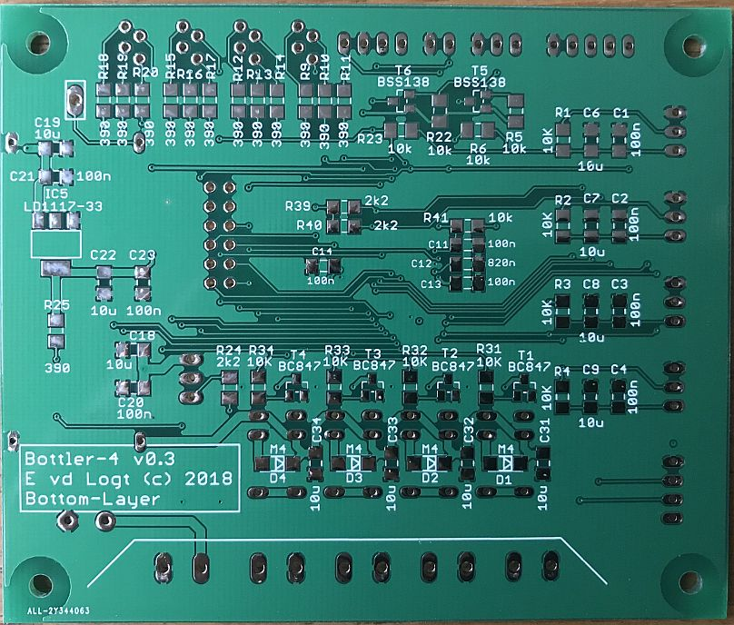

BOTTLER-4
==========

The purpose of this software is to create an automated bottler for home-brewing, that can fill 4 bottles at the same time. A flow sensor (YF-S402) is used for reading the beer volume and a solenoid valve is used for opening and closing of the beer-stream.

Software Development Environment
-----------
- Cosmic STM8 compiler. A license can be obtained free of charge from Cosmic-software.com. Install this first.
- ST Visual Develop (STVD). This can be obtained free of charge from st.com
- A coloured ST-Link V2 USB adapter (which are very cheap to find on ebay)

In order to program this thing, you can't have a code-size limit of 8 Kbytes, so IAR will not do the job. Fortunately, the Cosmic STM8 development environment (IdeaSTM8) has been made available free-of-charge. Just register and download and you have 
a development environment that nicely supports this device.

Quick start
-----------
To be defined.

Introduction
--------------
To be defined.

PCB Hardware
----------

 
*Eagle schematics v03 of the Beer bottler-4*

 
*PCB version 03 Top-Layer (made by allpcb.com)*

 
*PCB version 03 Top-Layer (made by allpcb.com)*

 
*PCB all components added*

